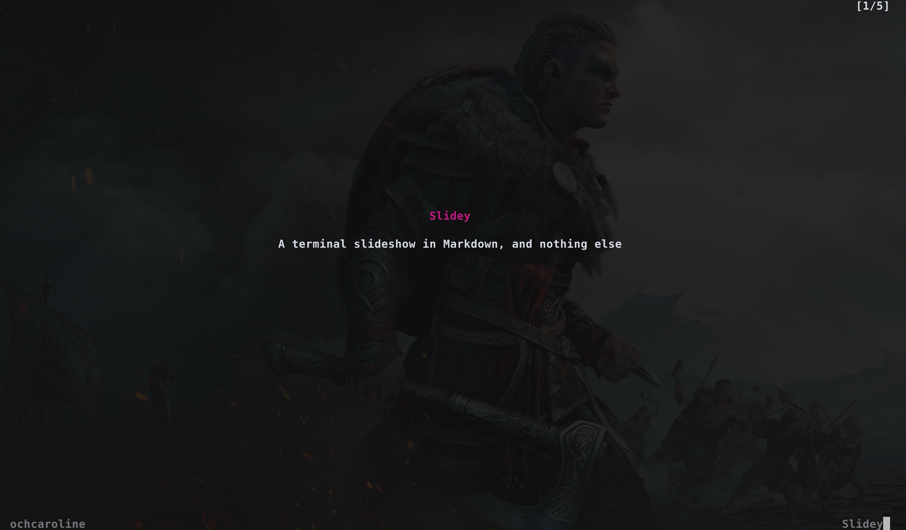

# slidey

Terminal markdown slide presenter.
And nothing freaking else.



## Why does it exists?

Because I was tired of bloated tools that do everything (and thus fail in things that I need them to do - show slides without crashing spectacularly)

It doesn't use loops like `bubbletea`, but it renders the slide once and then uses buffer inputs for steering. Which actually makes handling things like resolution and size changes (and also buffer heights) much easier.

## Usage

```
go build -o slidey .
./slidey example/demo.md
```

## Navigation

| Key                          | Action         |
| ---------------------------- | -------------- |
| `j` / `space` / `down arrow` | Next slide     |
| `k` / `up arrow`             | Previous slide |
| `q` / `Ctrl-C`               | Quit           |

## Slide format

Slides are separated by `---` in your markdown file. YAML frontmatter and HTML comments are stripped automatically.

If frontmatter has title and description - they will be shown as first slide, centered - as a title slide. A slide #0
If not - Slidey will skip to first slide.

````markdown
---
author: ochcaroline
title: Slidey, simple AF
description: Slidey, a minimal tui that shows slides
---

# Slide one

Some content

---

# Slide two

More content

---

# Slide three

```python
print("hello world")
```
````
